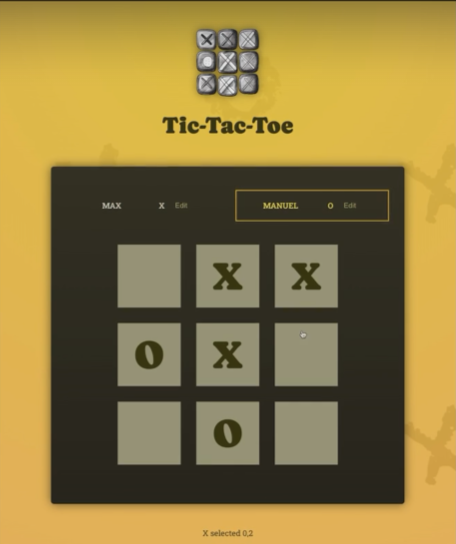

### Components in this project
1. Player component -   
2. GameBoard component -
3. Log component - 

### State in this project
1. activePlayer
   - initiate the first turn which is 'X'
   - focus on Player component which is thier turn.
   - send activePlayer to square in GameBoard component.
   - send activePlayer and row-col that was click to Log component.
2. gameTurn
   - initiate with empty array [ ]
   - send gameTurn to Log component.
   - which is look like
```
[
    {
        square: {
            row: 1,
            col: 3
        },
        player: "X"
    },
    {
        square: {
            row: 2,
            col: 2
        },
        player: "O"
    }
]

```

### How we update GameBoard
- initiate GameBoard with array 
  ```
  const initialGameBoard = [
        [null, null, null],
        [null, null, null],
        [null, null, null]
    ]
  ```
- update square on GameBoard by destructure old value then overwrite. /* best practice for React */
- control symbol which will overwrite GameBoard by activePlayer state.

### Feature
1. user can edit player name
2. each turn, must focus player turn
3. each turn, must log


### How to win !
- check GameBoard in every turn with all possible winning combination.
- 
